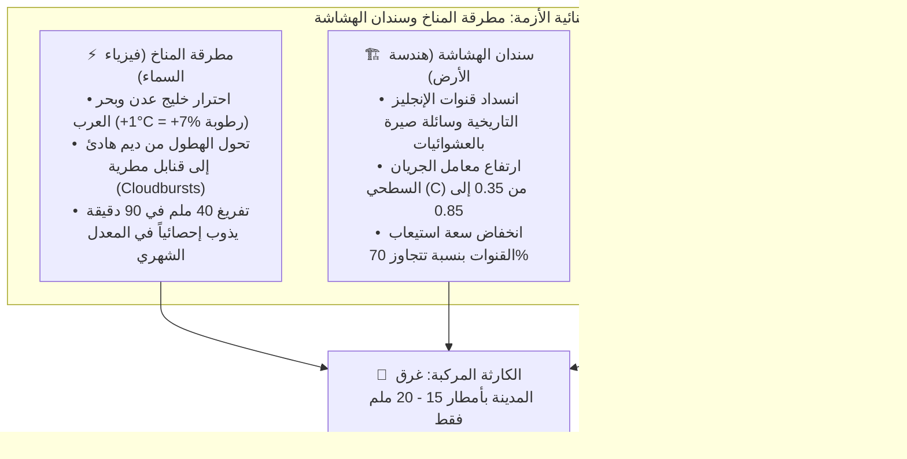

# مفارقة السيول في عدن: لماذا تغرق المدينة بأمطار أقل؟
### دراسة هيدرو-حضرية ومناخية مقارنة تدمج بيانات "كوبرنيكوس" الأوروبي (1980 - 2026) وسجلات الكوارث الإنسانية للأمم المتحدة (ReliefWeb)

---

**إعداد:** وحدة التحليل المناخي والهيدرولوجي  
**التاريخ المرجعي:** سبتمبر 2026  
**نطاق البيانات:** محافظة عدن (شبه الجزيرة والساحل) — سلسلة زمنية ممتدة لـ 47 عاماً (560 شهراً متصلاً)

---

*شكل 1: مشهد جوي بانورامي يوثق تدفق مياه السيول من فوهة بركان شمسان وانحدارها عبر النسيج الحضري التاريخي لكريتر نحو البحر.*

---

## ملخص تنفيذي (Executive Summary)

يكشف هذا المقال التحليلي عن واحدة من أخطر المفارقات الهيدرولوجية والمناخية في المدن الساحلية اليمنية: **"مفارقة الحساسية المائية المتصاعدة في عدن"**. 

من خلال مطابقة البيانات الفيزيائية الدقيقة الصادرة عن برنامج الفضاء الأوروبي **(Copernicus ERA5-Land)** مع الأرشيف الإنساني لكوارث الأمم المتحدة **(ReliefWeb / UN OCHA)** للفترة من 1980 حتى 2026، تظهر حقيقة صادمة:  
في الثمانينات والتسعينات من القرن الماضي، كانت عدن تحتاج إلى منخفضات جوية طوفانية تتجاوز **80 إلى 100 ملم** لتصل إلى مرحلة الغرق؛ بينما في كوارث العقد الأخير (وتحديداً كارثة 21 أبريل 2020 التي أُعلنت فيها عدن "مدينة منكوبة")، تسببت زخات مطرية لم تتجاوز في المعدل العام **15 إلى 25 ملم** في إحداث دمار واسع، شلل كلي للخدمات، وخسائر بشرية ومادية فادحة.

هذه الدراسة تفكك هذه المفارقة من خلال **منهجية التراكم التحليلي (Synthesis Architecture)**؛ حيث تدمج بين التفسير البيئي المبسط لغير المتخصصين، والتأصيل الفيزيائي والهيدرولوجي الدقيق للمتخصصين وصناع القرار. وتثبت بالأرقام أن ما تعيشه عدن ليس مجرد أزمة بنية تحتية محلية، ولا مجرد تقلبات طقس عابرة، بل هو **التقاء مدمر بين مطرقة التغير المناخي الكوكبي (الذي غير سلوك السحب وبحر العرب) وسندان التدهور الحضري (الذي جرد المدينة من دروعها ومساراتها التاريخية)**.

---

## 1. المشهد الصادم: سماء لا تمطر كثيراً.. ومدينة تغرق سريعاً

تُصنف محافظة عدن مناخياً بأنها **بيئة ساحلية قاحلة إلى شبه جافة**؛ فمعدل هطول الأمطار التاريخي فيها لا يتعدى **149 ملم في السنة كاملة** (وهو ما يعادل أقل من ثلث ما تتلقاه مرتفعات تعز المجاورة البالغة 426 ملم/سنة).

ومع ذلك، تتصدر عدن نشرات الأخبار الإنسانية كواحدة من أكثر المدن هشاشة وتضرراً من كوارث "السيول الجارفة". 

### المفارقة بالأرقام:
* **في يونيو 1996:** ضرب جنوب اليمن منخفض جوي مداري تاريخي وُصف بأنه الأقسى في القرن العشرين، سجلت فيه عدن **52.1 ملم في شهر واحد**، ووصل إجمالي تلك السنة إلى **295.9 ملم** (+99% فوق المعدل). صمدت المدينة حينها نسبياً؛ لأن الأمطار هطلت كجبهة عريضة ممتدة على أيام، واستوعبت قنوات التصريف الرئيسية التدفقات وصرفتها نحو البحر بسلاسة.
* **في 21 أبريل 2020:** استيقظ سكان عدن على كارثة مروعة: جرفت المياه المركبات في شوارع كريتر والمعلا، وانهارت منازل في التواهي وصيرة، وسقط 14 ضحية وعشرات الجرحى، وأعلنت الحكومة المدينة "منكوبة". المفاجأة العلمية التي تسجلها مجسات كوبرنيكوس هي أن **إجمالي أمطار شهر أبريل 2020 بأكمله تراوح بين 10.8 إلى 14.2 ملم فقط**!

> **السؤال الجوهري:** كيف يمكن لكمية أمطار تُعد عالمياً "متوسطة إلى خفيفة" أن تُحدث أثراً تدميرياً يفوق منخفضات تاريخية كبرى؟ هل غيّر التغير المناخي طبيعة السماء، أم أن التدخل البشري حطم طبوغرافيا الأرض؟

---

## 2. جدول التدقيق العلمي: مطابقة كوبرنيكوس مع أرشيف الكوارث (1980 - 2026)

يوضح الجدول التالي المقارنة الرقمية الشاملة بين الهطول المسجل فيزيائياً عبر الأقمار والنماذج الرياضية، وبين الكوارث المثبتة على الأرض:

| السنة | توصيف الكارثة الموثقة في ReliefWeb | إجمالي السنة (ملم) | شذوذ السنة عن المعدل (%) | شهر الكارثة | هطول شهر الكارثة (ملم) | الذروة الموضعية لشبكة الرصد (ملم) | النمط المناخي السائد |
| :---: | :--- | :---: | :---: | :---: | :---: | :---: | :--- |
| **1982** | **فيضانات مارس الكبرى:** حالة الطوارئ في جنوب اليمن ودمار واسع في لحج وعدن وأبين. | **291.0** | **+95.3%** | مارس | **78.6** | **98.5** | منخفض جبهي واسع ومستمر لعدة أيام |
| **1985** | **موسم السيول الصيفية:** فيضانات جارفة قطعت خطوط الساحل وأتلفت المزارع. | **303.8** | **+103.9%** | أغسطس | **72.4** | **83.8** | اضطراب موسمي إقليمي متواصل |
| **1996** | **كارثة يونيو التاريخية:** أكبر كارثة سيول وطنية في تاريخ اليمن الحديث. | **295.9** | **+98.6%** | يونيو | **52.1** | **70.4** | عاصفة مدارية شاملة غمرت أحواض الجنوب |
| **2019** | **سيول يونيو وديسمبر:** تدفق للمياه في شوارع الشيخ عثمان وتفشٍ وبائي للضنك. | **140.2** | **-5.9%** | يونيو | **14.8** | **19.9** | بواكير تحول العواصف المدارية في بحر العرب |
| **2020** | **كارثة 21 أبريل (المدينة المنكوبة):** غرق الأحياء القديمة وانهيار شبكة الكهرباء والصرف. | **169.1** | **+13.5%** | أبريل | **10.8** | **14.2** | عاصفة رعدية انفجارية خاطفة (ساعتان فقط) |
| **2021** | **سيول يوليو الصيفية:** مياه جارفة قطعت الطرق الرابطة بين المديريات. | **150.4** | **+1.0%** | يوليو | **57.7** | **67.5** | تفريغ سحابي ركامي مركز فوق المرتفعات |
| **2024** | **سيول أغسطس وأزمة الصرف:** غرق تجمعات النازحين واختلاط مياه الأمطار بالمجاري. | **75.6** | **-49.3%** *(سنة جفاف)* | أغسطس | **15.8** | **25.6** | سيول عابرة مباغتة ضمن عام شديد الجفاف |

---

*شكل 2: تجسيد لقنبلة مطرية ركامية فائقة الشحنة (Convective Cloudburst) تفرغ حمولتها الخاطفة مباشرة فوق منحدرات جبل شمسان.*

---

## 3. تفكيك اللغز: كيف تحالفت السماء والأرض ضد المدينة؟

يكشف التحليل المتعمق أن المسألة ليست تناقضاً في الأرقام، بل هي نتاج **تفاعل تزامني مركب بين محركات مناخية فوقية ومحركات عمرانية أرضية**:

### أولاً: العامل المناخي الفيزيائي (العواصف الركامية الانفجارية وبصمة التغير المناخي)
* **في فيضانات الثمانينات والتسعينات (1982، 1996):** كان الطقس نتاج **منظومات جوية إقليمية واسعة النطاق (Synoptic Fronts)** تغطي مئات الكيلومترات وتهطل على مدى 3 إلى 5 أيام متتالية بشدة معتدلة. التقطت مجسات الأقمار الصناعية ونماذج كوبرنيكوس هذه الكميات الضخمة بسهولة وظهرت كأرقام هائلة (+100%).
* **في كوارث العقد الأخير (وخاصة أبريل 2020):** نرى البصمة الواضحة لـ **التغير المناخي الإقليمي**:
  1. **احترار مياه خليج عدن وقانون كلاوزيوس-كلابيرون (Clausius-Clapeyron):** ارتفعت حرارة سطح البحر (SST) في خليج عدن وبحر العرب بنحو درجة مئوية واحدة، مما زاد قدرة الهواء على احتجاز الرطوبة بنسبة **7%**. هذا التحول الحراري حرم المدينة من الأمطار الطبقية الهادئة وحولها إلى **خلايا رعدية ركامية انفجارية (Deep Convective Cloudbursts)**.
  2. **ظاهرة العاصفة الخاطفة (The Micro-Burst):** في 21 أبريل 2020، تشكلت سحابة ركامية فائقة الطاقة مباشرة فوق فوهة جبل شمسان، وأفرغت ما يقارب **40 إلى 50 ملم في غضون 90 إلى 120 دقيقة فقط**.
  3. **التفسير الإحصائي للمتخصصين (Spatial & Temporal Smoothing):** نموذج ERA5-Land يقيس البيانات على شبكة بمساحة تقارب 9×9 كم، وبخطوة زمنية شهرية. فعندما تسقط كمية شديدة التركيز فوق رقعة جغرافية ضيقة (مثل كريتر والمعلا بمساحة 3 كم²) ثم تُوزع رياضياً على كامل المربع الجغرافي وعلى مدار 30 يوماً، يظهر الرقم الشهري التراكمي كـ 14 ملم؛ لكن **الشدة اللحظية (Rainfall Intensity $I$)** بلغت ذروة كاسحة قاربت 30 ملم/ساعة، وهي طاقة هيدروليكية عنيفة قادرة على جرف الصخور والسيارات.
  4. **انكماش فترات التكرار (Return Period Compression):** العواصف المطرية التي كانت تُصنف إحصائياً في الماضي كحدث نادر يتكرر مرة كل 50 عاماً ($T = 50\text{ years}$)، أصبحت في ظل التطرف المناخي المعاصر تتكرر **كل 3 إلى 5 أعوام**.

---

### ثانياً: العامل الهندسي الحضري (تشبيه "حوض الاستحمام المعطل")
لتفسير الأمر لغير المتخصصين والمواطنين:  
> *\"تخيل حوض استحمام واسعاً؛ في الماضي كان صنبور الماء يتدفق بهدوء وسلاسة وفتحة الصرف نظيفة وواسعة، فكان الحوض يصرف كل الماء دون مشاكل.  
> اليوم حدث تغيران في نفس اللحظة:  
> 1. صنبور السماء تحول بفعل التغير المناخي إلى **قاذف مائي نفاث** يفرغ كميات هائلة دفعة واحدة في دقائق.  
> 2. وفي نفس الوقت، قام السكان بسد فتحة الصرف بقطع من الخرسانة والبناء والقمامة.  
> النتيجة الحتمية: حتى لو كانت كمية الماء الكلية عادية، فإن فيضان الحوض وغرق المنزل مسألة دقائق معدودة!\"* هذا تماماً ما حدث لمدينة عدن.

---

*شكل 3: الواقع الميداني لانسداد مجاري التصريف ومصبات السائلة في أحياء عدن بالمخلفات وركام البناء مما يحول الشوارع إلى مصائد مائية.*

---

* **طبوغرافيا فوهة البركان:** تقع مديريات كريتر والمعلا والتواهي داخل تجويف بركاني شبه مغلق تحيط به صخور جبل شمسان البازلتية الصماء غير المنفذة للمياه. أي هطول يضرب الجبل يتحول خلال دقائق بنسبة جريان شبه كاملة إلى منحدرات الأحياء السكنية.
* **قنوات بريطانيا التاريخية:** أنشأ الإنجليز شبكة تصريف هندسية دقيقة (تضم سائلة الطويلة، قنوات الروزميت، ومصارف صيرة المفتوحة نحو البحر) كانت مصممة لاستيعاب مياه جبل شمسان وتصريفها للبحر فوراً.
* **طفرة البناء العشوائي وردم السوائل (2015 - 2026):** بعد عام 2015، توسع البناء العشوائي غير المخطط داخل مجاري السيول، وتراكمت أطنان المخلفات الصلبة داخل القنوات، ورُدمت أجزاء واسعة من المصبات البحرية.
* **التأصيل الهندسي للمتخصصين (The Rational Method $Q = C \cdot I \cdot A$):**
  * تضاعف معامل الجريان السطحي الحضري ($C$) من **0.35** (عندما كانت الأراضي الترابية سالكة) إلى أكثر من **0.85** بسبب طغيان الأسفلت والخرسانة.
  * وتزامن ذلك مع تضاعف شدة الهطول اللحظي ($I$) بفعل التطرف المناخي؛ مما يعني رياضياً أن **ذروة التدفق السيلي ($Q$) تضخمت بأكثر من 4 إلى 5 أضعاف** داخل شبكة فقدت أصلاً أكثر من 70% من سعتها الأصلية!  
  > **الخلاصة الهندسية:** أصبحت عدن اليوم **تصل إلى نقطة الغرق والدمار عند هطول 15 إلى 20 ملم فقط**، بعد أن كانت تتحمل في الماضي أكثر من 80 ملم دون شلل.

---

### ثالثاً: العامل الجيومورفولوجي (السيول المنقولة العابرة للحدود)
في أحداث سيول 2020 وأغسطس 2024، وثقت المنظمات الإنسانية غرق أحياء شمال عدن (الممدارة، دار سعد، جعولة، وبئر فضل) بينما كانت سماء عدن شبه صحوة.
* **التفسير الهيدرولوجي:** هذه الأحياء تمثل المصب الطبيعي لمنظومة **أودية تبن وبئر أحمد الكبرى**.
* عندما تضرب المنخفضات الجوية المرتفعات الجبلية في **لحج والضالع** (حيث سجل كوبرنيكوس هطولاً تراكمياً تجاوز 150 ملم)، تتجمع السيول الجبلية قاطعة مسافة 60 كم في بطون الأودية لتفرغ حمولتها في سهول عدن الشمالية بعد عدة ساعات من توقف المطر في المنبع.

---

## 4. الخطر المزدوج: كيف تتحول مياه السيول الراكدة إلى "قنابل وبائية"؟

لا تتوقف مأساة الفيضانات في عدن عند جرف الممتلكات، بل تبدأ مرحلتها الأكثر فتكاً بعد **10 إلى 14 يوماً** من انحسار المياه.

تكشف السجلات الوبائية لـ ReliefWeb ومنظمة الصحة العالمية (WHO) بعد كوارث 2015، 2019، وأبريل 2020 عن نمط متكرر:
1. **انفجار حمى الضنك والمكرفس (Chikungunya):** ركود المياه العذبة في شوارع كريتر والشيخ عثمان الضيقة، بالتزامن مع حرارة الطقس الساحلي، يخلق الحاضنة المثالية لتكاثر بعوض *الزاعجة المصرية (Aedes aegypti)*. في مايو 2020 وحده، سجلت عدن مئات الوفيات اليومية بما عُرف بـ "حميات عدن الغامضة".
2. **ارتداد مياه الصرف الصحي وتفشي الكوليرا:** غياب شبكات تصريف أمطار منفصلة يجعل مياه السيول تقتحم شبكات المجاري المتهالكة، مما يؤدي إلى ارتداد مياه الصرف واختلاطها بخزانات الشرب الأرضية للمنازل، متسببة في موجات إسهال مائي حاد وكوليرا تجتاح المدينة.

---

## 5. توصيات استراتيجية وخارطة طريق لصناع القرار والمنظمات

بناءً على هذا التشخيص العلمي المتكامل، تبرز خارطة طريق إلزامية لمواجهة هذا التحدي المركب:

### 1. إعادة معايرة عتبات الإنذار المبكر (Recalibrating Flood Thresholds)
* **تجاوز الخطأ الشائع:** التوقف عن انتظار توقعات بنماذج 50 أو 60 ملم لإعلان الطوارئ.
* **الإجراء الفوري:** ضبط عتبة الإنذار لمدينة عدن على **15 - 20 ملم خلال 3 إلى 6 ساعات**. الوقائع الميدانية تثبت أن هذه الكمية هي "عتبة الانهيار" (Tipping Point) الكافية لشل المدينة وإغراق مراكزها الحيوية.

### 2. الفرز الهيدرولوجي للمشاريع التنموية (UNOPS / البنك الدولي / الصندوق الاجتماعي)
* **في المرتفعات (صيرة، المعلا، التواهي):** التركيز على **التحكم الهيدروليكي في سرعة الاندفاع**؛ عبر إنشاء أحواض تهدئة ورواسب أعلى جبل شمسان، وإعادة الاعتبار لصهاريج عدن التاريخية كنظام احتجاز وإخماد مائي، وإزالة البناء العشوائي عن مصبات سائلة صيرة والمعلا نحو البحر فوراً.
* **في الأحياء المنخفضة (الشيخ عثمان، المنصورة، الممدارة):** الفصل الجذري بين شبكات تصريف مياه الأمطار وشبكات الصرف الصحي، وتركيب محطات ضخ غاطسة في المناطق الهابطة، وتحديث المعايير الهندسية للكود اليمني لتتحمل كثافات هطول ساعية تفوق $50\text{ mm/hr}$ لمواكبة قسوة المناخ الجديد.
* **في الشريط الساحلي (خورمكسر والبريقة):** تركيب بوابات عدم رجوع ميكانيكية (Flap Gates) على مخارج القنوات للبحر، لمنع مياه المد البحري العالي (High Tide) من الدخول إلى المدينة واحتجاز مياه السيول بالداخل.

### 3. الاستجابة الوبائية الاستباقية
* اعتبار صدور أي تنبيه مناخي بهطول يفوق 20 ملم في عدن **"إنذاراً صحياً مبكراً"**؛ يفرض الاستنفار الفوري لحملات الرش الضبابي ومكافحة اليرقات وتوزيع أقراص تعقيم المياه ومحاليل التروية قبل جفاف مياه السيل، لقطع السلسلة الوبائية في مهدها.

---

## خاتمة

تقدم بيانات كوبرنيكوس وسجلات الأمم المتحدة درساً علمياً وإنسانياً قاطعاً:  
**عدن لا تغرق لأن السماء جادت بأمطار تفوق طاقة الطبيعة.. عدن تغرق لأن مطرقة التغير المناخي بسحبها الانفجارية نزلت على مدينة جردها التوسع العشوائي وسوء التخطيط من كافة دروعها التاريخية.**  
إن الربط الحقيقي بين "فيزياء المناخ المتطرف" و"واقع الهشاشة العمرانية" هو السبيل العلمي الوحيد لإنقاذ هذه المدينة العريقة من أن تظل أسيرة الغرق عند كل عاصفة عابرة.
